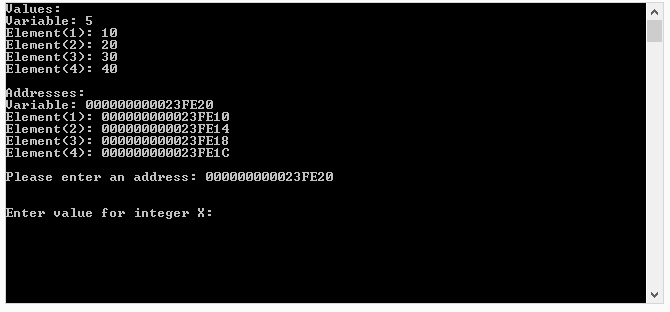
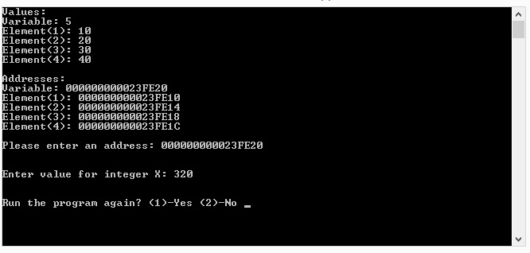
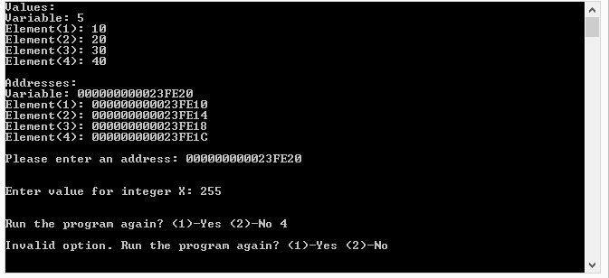

# lbyec72-ej1-p4-pointers-fionapangilinan
lbyec72-ej1-p4-pointers-fionapangilinan created by GitHub Classroom

screenshots:

Main screen with values of the variable and array elements and their addresses

Input of address works. Then asks for integer X.

A value for x is entered.

Program asks to run the program again?

Choosing choice 1:

The values of the variable and array elements change.

Choosing choice 2 exits the program.

Choosing an invalid option asks the same question again to the user.

When an invalid address is entered:

